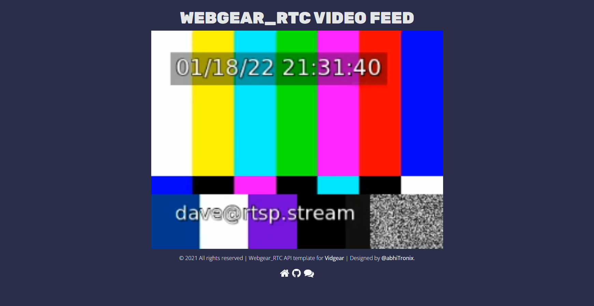

# peek-a-boo
Simple dockerized service exposing a videofeed through WebRTC via a HTTP frontend. Shamelessly copied from the [`webcam` example](https://github.com/aiortc/aiortc/tree/9383bf0a4378379260baf8bf41c789725cd2e28f/examples/webcam) provided by the [`aiortc`](https://github.com/aiortc/aiortc) team. Automatically built as a docker image on release. The image is available from here: https://github.com/orgs/MO-RISE/packages

Example setup:
```yaml
version: '3'
services:

  peek-a-boo:
    image: ghcr.io/mo-rise/peek-a-boo:latest
    ports:
      - 8000:8000
    command: [ "--play-from", "rtsp://rtsp.stream/pattern" ]
```

Head to http://localhost:8000 and click the `start`button which should (after a few seconds) yield:


